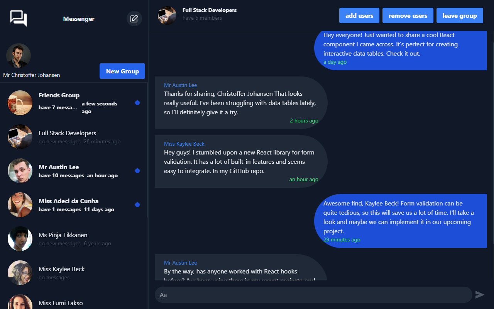

# Full Stack Messenger Application

This is a full stack messenger application built using the MERN stack ***(MongoDB, Express.js, React.js, Node.js)*** and ***WebSocket*** technology. The application allows users to send and receive messages, block and unblock users, create groups, add and remove users from groups, and receive notifications for new messages.

## screenshot
  

note - In contrast to the popular messenger app that rarely features hidden in methods like three dots (…), in this app the UI is designed to fit most of the features in the screenshot.

## Features
- Real-time messaging using WebSocket
- Blocking and unblocking users
- Group creation and management
- Adding and removing users from groups
- Leaving groups
- Notification system for new messages

## Technologies Used

- MongoDB: A NoSQL database used for storing user information, messages, and group data.
- Express.js: A web application framework used for building the backend API.
- React.js: A JavaScript library used for building the frontend user interface.
- Node.js: A JavaScript runtime used for running the server-side code.
- WebSocket: A communication protocol that enables real-time, bidirectional communication between the server and clients.
- MUI (Material-UI): A React UI library that provides pre-designed components and styling for building user interfaces.
- Tailwind CSS: A utility-first CSS framework for quickly styling web applications.
- Redux: A predictable state container for managing the application's global state.
- jsonwebtoken: A library for generating and verifying JSON Web Tokens (JWT) for user authentication and authorization.

## installation
* Before running the application, ensure that you have the following software installed: Node.js (and npm), MongoDB and Git.
* Clone the repository
```bash
git clone https://github.com/aviv1620/full-stack-messenger.git
```
### server
* In `.env` file set the `MONGODB_CONNECT_URL` to your database address.
* Open new terminal and navigate to the server directory.
* Install the dependencies
```bash
npm install
```
* Insert demo users.
```bash
npm run initTestDb
```
* Start the server:
```bash
npm run start
```
### client
* if you change the port or run the server not locally change the URL in the `.env` file.
* Open another terminal and navigate to the client directory.
* Install the dependencies
```bash
npm install
```
* Start the react host
```bash
npm run start
```
### test
In the login screen have username and paswoord for the demo users.
* Open normal tab in the browser and login with one of the demo users.
* Open incognito tab(ctrl+shift+N) in the browser and login with other user from the demo users.

## architecture
The database holds three collections: Groups, Conversations and Users.
Every document holds the field "lastUpdateDate".
The field updates every time that an occurs an action "update" or action "create".
In the BLL layer, there has a function "getLastUpdate" that return the new date based on user and date point.
have two communication protocols. WebSocket and RestAPI.
The WebSocket responsibility is to notify the users and push the new data from getLastUpdate.
All remaining features communicate to the server by Rest API.

## Acknowledgements
ravisankarchinnam from the website tailwindcomponents for the HTML template.
The generator websites Randomuser dot me and Lorem Picsum.
The developers of every open source technology that I use.
This project is licensed under the MIT License.


